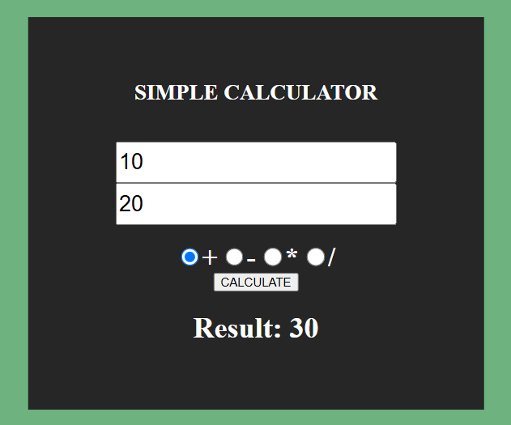

This calculator was made during my internship at CompassUOL as a way of studying to learn Web Development.

The first is a basic calculator, which does all the operations.

The second is a tip calculator, it can be used at payment checkouts to calculate the total amount + tip amount and divide it for all the people who will pay.

